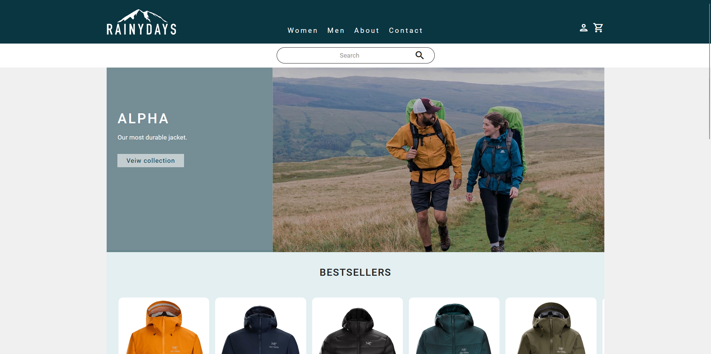

# Rainydays | Cross Course Project



## Description

[Rainydays](https://rainydays-andersen.netlify.app/) is a web shop developed by me throughout my first year of the Front-end Development program at Noroff. The site has advanced in line with the course progression. By using HTML, CSS, JavaScript and headless WordPress I have created an interactive and dynamic web shop, with a responsive, tidy, and modern design.

Key features includes:
- a home page with a 'bestsellers' section displaying products in a carousel
- product specific pages consisting of content dynamically built using query string parameters
- a contact page with form validation which displays an error message if requirements are not met
- content that is managed with WordPress, and is fetched using WordPress REST API (CMS is headless)
- a simulated purchase/cart functionality
- a user-centric design responsive across different sized devices which also appeals to the target audience

## Built With

This site is built with the following:

- HTML
- CSS
- JavaScript
- Headless WordPress

## Getting Started

### Installing

1. Open command window
2. Select project destination
3. Run:

```bash
git clone https://github.com/Noroff-FEU-Assignments/cross-course-project-anneandersen92.git
```

### Running

No requirements.

## Contributing
To contribute to the project, please do the following:

1. Fork the repository
2. Create a new branch from master:
```bash
git checkout -b new-contribution.
```
3. Make your changes.
4. Stage and Commit your changes:
```bash
git commit -am 'Add a relevant commit message'
```
5. Push to the branch:
```bash
git push origin new-contribution
```
6. Submit a pull request

## Contact

[My Email](mailto:anne_92@live.no?subject=OH%20Sheet%20inquiry)

[My LinkedIn page](https://www.linkedin.com/in/anne-andersen-7ba49b58)
